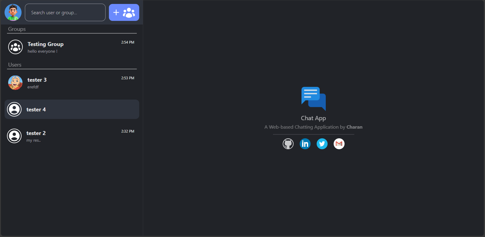
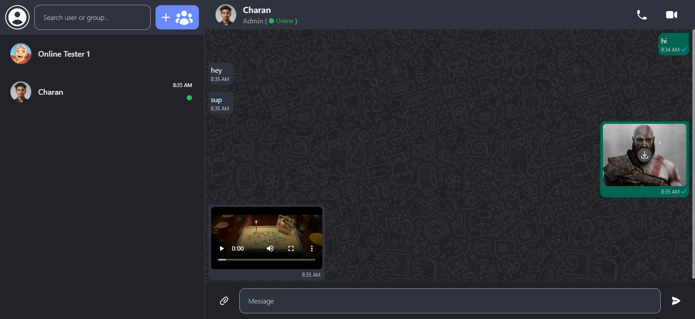
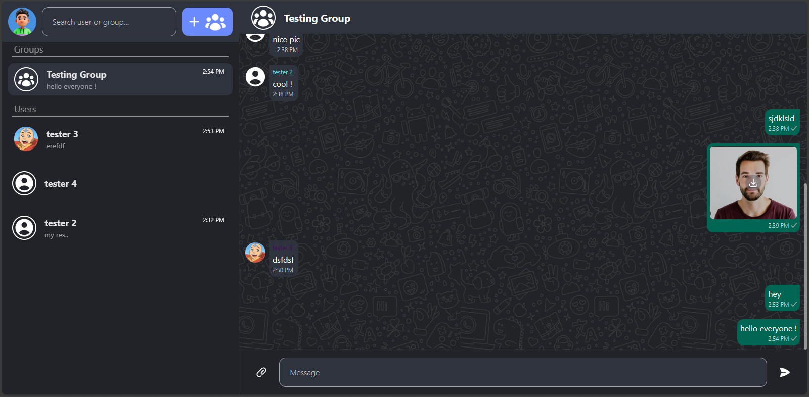
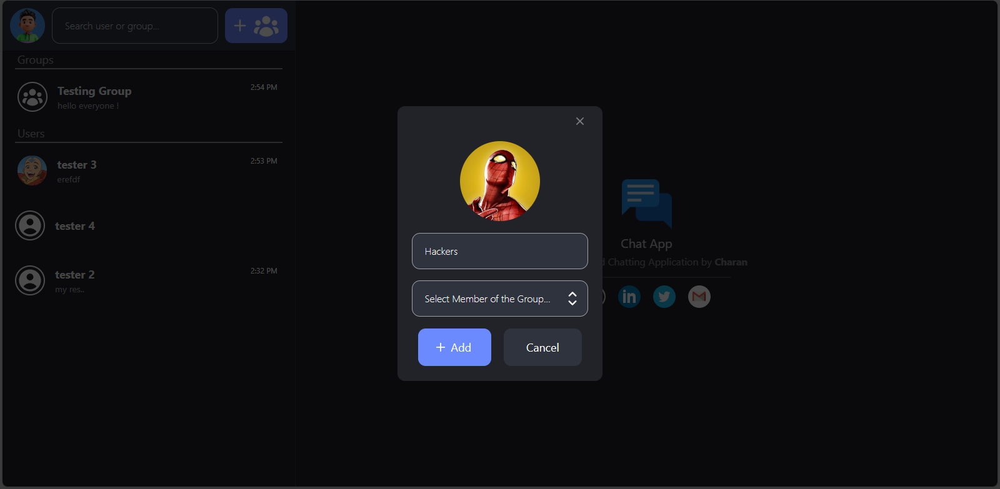
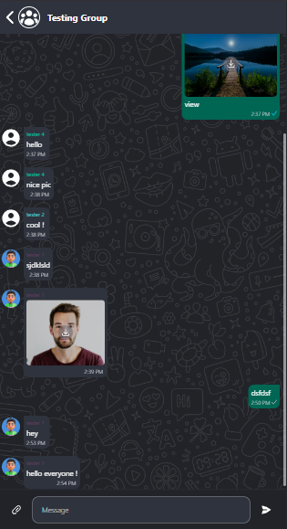

# Chat App - [Live Link](https://chat-app-by-charan.vercel.app/) - [Demo Link](https://www.youtube.com/watch?v=5_Ouh0Q_aQo) - [Blog Post](https://blogsbycharan.hashnode.dev/how-to-build-a-chat-app)

A Chatting Web Application similar to [WhatsApp](https://web.whatsapp.com/) where users can share messages, images, videos, and any other files with a single (or) multiple recipients.

# Features

- Unique Chat room for every pair of users. (End-to-End)
- Unique Chat room for a selected set of users. (Groups)
- Sharing Image, Video, and any other File.
- Realtime Messaging with Status Indicators:
  - Waiting - 
  - Sent - 
  - Seen - 
- Last-Updated-Time and Last-Message on every Chat Opening Bar.
- Usage of Queue Data Structure to Synchronize Messages and avoid Race Condition.
- Ordering the Chats (Groups and Profiles) based on Last-Updated-Time.
- New-unseen-message Indicator. (Notification)
- **Responsive Design** - Split Pages View for Large (and) Single Page View for Small Screen Sizes.

# Tech Stack Used

- ReactJS Framework
- RecoilJS - For Global State Management
- TypeScript - For Custom Types
- Firestore DB (and) Firestore Storage
- TailwindCSS
- Heroicons

# Pages / Views

1. Welcome Screen

2. Personal Chat Screen

3. Group Chat Screen

4. Add-Group Screen

5. Mobile View Chat Screen

6. Mobile View Chats List Screen

